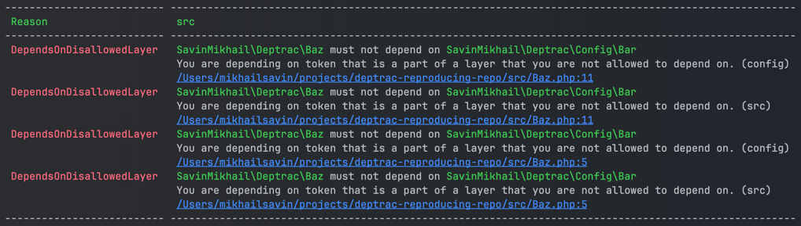

## Minimal bag reproducer repo for qossmic/deptrack

start steps:

- ```composer install```
- ```make dep```

I got


So I expect deptrac to differentiate ./config from ./src/Config, but it doesn't happen, and it scolds that src layer depends on src layer AND that src depends on config layer, which both not proper behavior, I think

Possibly the part of the problem is that I use macOS, which is case-insensitive to directories

Mb I misconfigured deptrac
